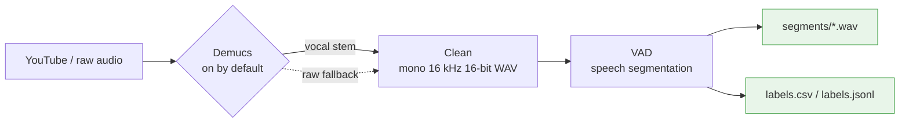
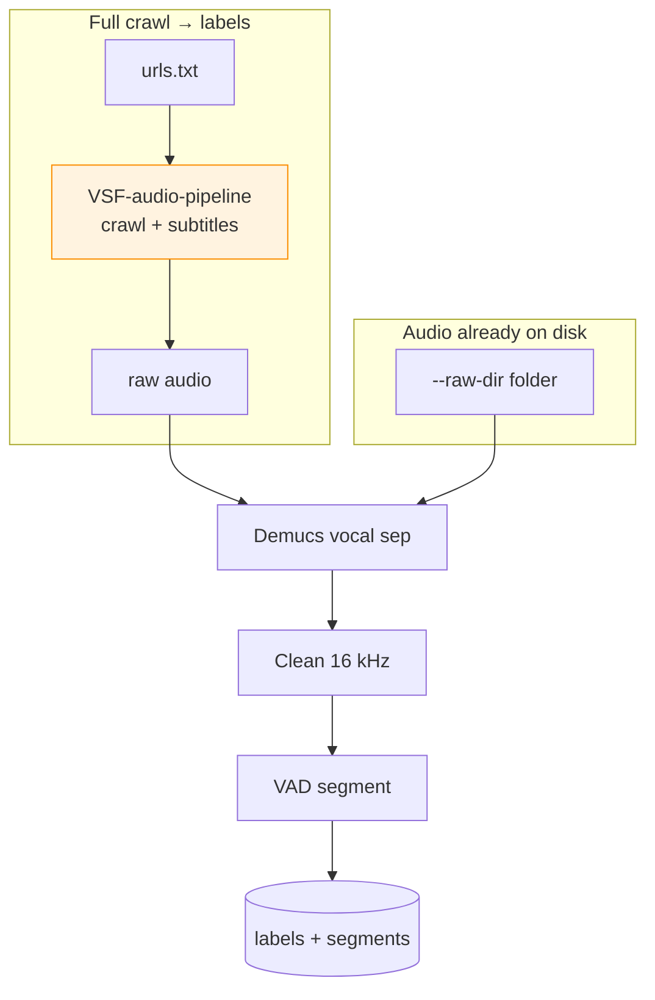

# VSF-TTS

Vietnamese TTS **data pipeline** for VSF (Vin Smart Future).
Turns raw / crawled audio into clean, labeled speech segments ready for TTS training.



---

## Pipeline

| Stage | What it does |
|-------|--------------|
| **Crawl** | Download audio + subtitles from YouTube via the `VSF-audio-pipeline` repo |
| **Demucs** | Separate **vocals** from background music (on by default, raw fallback) |
| **Clean** | Downsample vocal stem → mono 16 kHz 16-bit PCM WAV |
| **VAD** | Silero-based VAD cuts speaking segments |
| **Label** | Emit one row/segment: `segment_id,label,source_file,...,start,end,duration` |

Demucs runs on full-quality raw audio; only the vocal stem is downsampled and fed
into VAD, so segments are clean speech (better for TTS).

### Two run modes



`scripts/run_vsf_github_to_labels.py` = full crawl mode.
`scripts/end_to_end_pipeline.py` = local audio mode.

## Repo layout — Pipeline phases

| Phase | Thư mục | README | Mô tả |
|---|---|---|---|
| **0 — Crawl** | `external_repos/VSF-audio-pipeline/` | [docs/phase-00-crawl.md](docs/phase-00-crawl.md) | YouTube → raw audio |
| **1 — Separate** | `.venv-demucs/`, `scripts/demucs_env.py` | [docs/phase-01-separate.md](docs/phase-01-separate.md) | Demucs vocal separation |
| **2 — Clean** | `scripts/end_to_end_pipeline.py` | [docs/phase-02-clean.md](docs/phase-02-clean.md) | ffmpeg → mono 16kHz 16-bit |
| **3 — VAD** | `VAD/` | [VAD/README.md](VAD/README.md) · [docs/phase-03-vad.md](docs/phase-03-vad.md) | Silero V6 ONNX segmentation |
| **4 — Label** | `scripts/` | [scripts/README.md](scripts/README.md) · [docs/phase-04-label.md](docs/phase-04-label.md) | Cut WAV + manifest |
| **5 — Finetune** | `finetune/` | [finetune/README.md](finetune/README.md) · [docs/phase-05-finetune.md](docs/phase-05-finetune.md) | Retrain VAD model |
| **6 — Eval** | `eval/wer/` | [eval/wer/README.md](eval/wer/README.md) · [docs/phase-06-eval.md](docs/phase-06-eval.md) | WER/CER quality check |

Not tracked (see [.gitignore](.gitignore)): virtualenvs, `pipeline_runs/` output,
datasets (`finetune/data*`), logs. The crawler at `external_repos/VSF-audio-pipeline`
is a **git submodule** (pinned commit, fetched on clone). Small model artifacts
(`*.onnx`, `*.pth`) **are** committed so the pipeline runs after clone.

## Khi có vấn đề → tìm ở đâu

| Triệu chứng | Phase | Nơi debug |
|---|---|---|
| Download fail / 403 | Phase 0 | [docs/phase-00-crawl.md](docs/phase-00-crawl.md) |
| Demucs crash / not found | Phase 1 | [docs/phase-01-separate.md](docs/phase-01-separate.md) |
| ffmpeg error / wrong format | Phase 2 | [docs/phase-02-clean.md](docs/phase-02-clean.md) |
| 0 segments / quá nhiều segments | Phase 3 | [docs/phase-03-vad.md](docs/phase-03-vad.md) |
| Segment bị cắt sai / manifest thiếu | Phase 4 | [docs/phase-04-label.md](docs/phase-04-label.md) |
| Finetune không hội tụ / OOM | Phase 5 | [docs/phase-05-finetune.md](docs/phase-05-finetune.md) |
| WER cao / transcript rác | Phase 6 | [docs/phase-06-eval.md](docs/phase-06-eval.md) |

## Setup on a new machine

Prereqs: **Python 3.12**, **ffmpeg** in PATH, **git**, **uv**.

```powershell
git clone --recursive <this-repo-url> TTS    # --recursive pulls the crawler submodule
cd TTS
.\setup_new_machine.ps1            # builds CPU venvs + crawler backend env
.\setup_new_machine.ps1 -Gpu       # also build .venv-demucs-cu128 (needs CUDA 12.8)
.\setup_new_machine.ps1 -Smoke     # run the offline smoke test after setup
```

Already cloned without `--recursive`? Run `git submodule update --init --recursive`.
Manual (not in git): the crawler's `.env` (from its `.env.example`) and
`external_repos/VSF-audio-pipeline/cookies/youtube.txt` for crawling.

## Environments

Three isolated venvs (heavy deps kept apart):

| venv | Purpose | Install |
|------|---------|---------|
| `.venv-vad` | VAD + pipeline (no torch) | `pip install -r VAD/requirements.txt` |
| `.venv-demucs` | Demucs CPU (torch 2.2.2 pinned) | `pip install -r requirements-demucs.txt` |
| `.venv-demucs-cu128` | Demucs GPU (torch 2.8, CUDA 12.8) | `pip install -r requirements-demucs-cu128.txt` |

> Torch pins matter: torchaudio ≥ 2.9 routes through torchcodec and breaks Demucs;
> NumPy 2.x breaks torch 2.2.x. Keep `numpy<2`, `torch==2.2.2` for the CPU env.

## Quickstart

### Audio already downloaded

```powershell
python scripts\end_to_end_pipeline.py `
  --raw-dir tmp `
  --work-dir pipeline_runs\my_run `
  --refine-boundaries
```

Accepts `.wav .mp3 .m4a .aac .flac .ogg .opus .webm .mp4 .mkv`.

### Full crawl → labels

```powershell
Set-Content urls.txt "https://www.youtube.com/watch?v=VIDEO_ID"

python scripts\run_vsf_github_to_labels.py `
  --urls-file urls.txt `
  --batch-name batch_001 `
  --work-dir pipeline_runs\batch_001 `
  --refine-boundaries
```

Add `--cookie-file <youtube.txt>` for age/region-gated videos.
Disable separation with `--no-demucs`; point a torch env via `--demucs-cmd`,
`--demucs-device cuda` for large batches.

### Outputs

```text
<work-dir>/
  clean_wav/      normalized WAV (VAD-ready)
  segments/       one WAV per speaking segment
  labels.csv      tabular manifest
  labels.jsonl    one JSON object per segment
```

## VAD defaults

```text
threshold=0.7   min_volume=0.6   start_secs=0.1   stop_secs=0.45
merge_gap_secs=0.5   min_speech_secs=0.08
```

Tune with `--threshold`, `--min-volume`, `--refine-boundaries`.

## Finetune & eval

- Finetune Silero VAD on Vietnamese data → [finetune/README.md](finetune/README.md)
- WER evaluation → [eval/wer/README.md](eval/wer/README.md)

## Docs

- [PIPELINE.md](PIPELINE.md) — full end-to-end reference
- [VAD/README.md](VAD/README.md) — VAD model + serving
- [docs/](docs/README.md) — project plans, reviews, finetune history (AI context)
