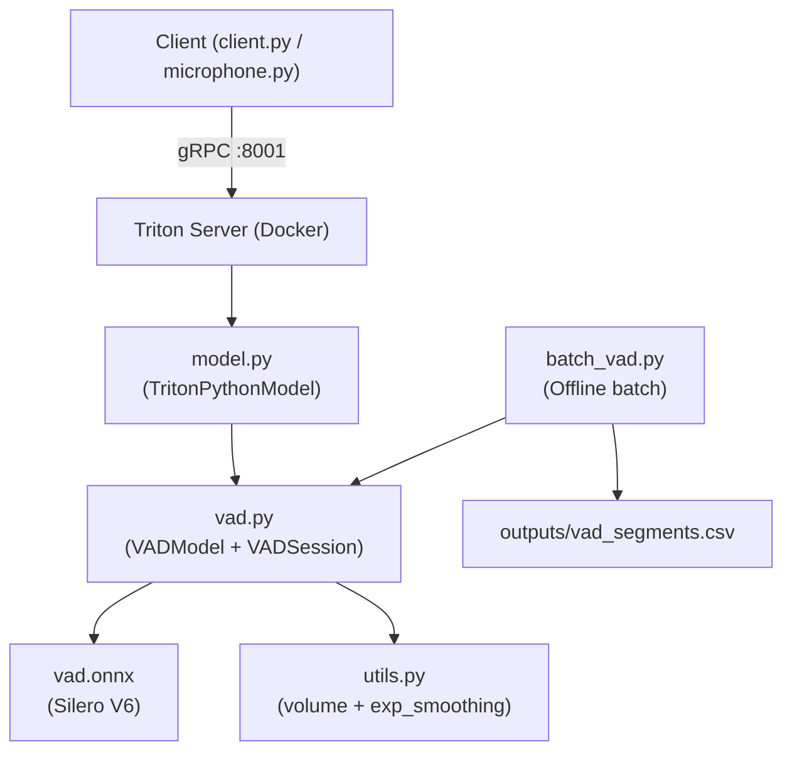
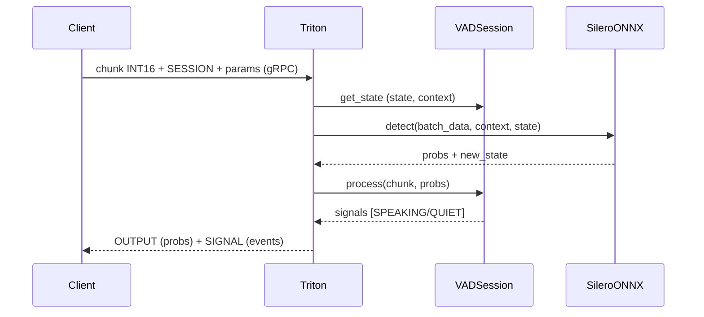

# 📋 Project Review — VAD TTS Server

**Ngày review:** 2026-06-10  
**Phạm vi:** `e:/VSF/TTS/`  
**Đánh giá tổng thể:** ⭐⭐⭐⭐ (4/5)

---

## 1. Tổng quan dự án

Dự án xây dựng một **Voice Activity Detection (VAD) Server** phục vụ cho pipeline TTS (Text-to-Speech), với hai chức năng chính:

| Chức năng | Mô tả |
|---|---|
| **Turn Detection** | Nhận diện khi user bắt đầu / dừng nói (SPEAKING / QUIET) |
| **Batch Segmentation** | Phân đoạn offline toàn bộ thư mục file `.wav` thành CSV |

**Stack kỹ thuật:**
- **Model:** Silero VAD v6 (ONNX) — đã được xác nhận là bản mới nhất
- **Serving:** NVIDIA Triton Inference Server (Python backend)
- **Tăng tốc:** OpenVINO CPU execution accelerator
- **Client:** `tritonclient.grpc`, `sounddevice`

---

## 2. Kiến trúc hệ thống

### Luồng xử lý chính (Triton)

---

## 3. Phân tích từng thành phần

### 3.1 `vad.py` — Core Logic ✅ Tốt

**Điểm mạnh:**
- `VADSession` triển khai state machine 4 trạng thái rõ ràng: `QUIET → STARTING → SPEAKING → STOPPING → QUIET`
- **Hysteresis threshold** (negative_confidence) tránh flip-flop khi ở ngưỡng biên
- **Exponential smoothing** volume giúp chống noise tốt
- `reset_state()` định kỳ sau mỗi 5 giây — tránh drift model state trong session dài

**Điểm cần chú ý:**
- `VADModel.detect()` concatenate `context` vào mỗi chunk input — đây là hành vi khác với `VADIterator` chính thức của Silero (đã ghi nhận trong `implementation_plan_2.md`). Chưa rõ ảnh hưởng tới accuracy so với cách dùng chuẩn.

---

### 3.2 `model.py` — Triton Backend ⚠️ Có một số vấn đề

**Điểm mạnh:**
- Quản lý session theo `sess_id` (UUID) — xử lý được nhiều user đồng thời
- Dùng `loguru` với log level từ env var — linh hoạt cho production vs debug

**Vấn đề phát hiện:**

> [!WARNING]
> **Bug tiềm ẩn — biến `sr` dùng ngoài phạm vi:**  
> Ở dòng 186, `batch_state` là `[:, idx, :]` khi lấy lại, nhưng `sr` trong vòng lặp for được tái sử dụng sau khi loop kết thúc. Nếu `sequence_list` rỗng (không có `ready=True`), `sr` có thể chưa được gán.

> [!WARNING]
> **Thiếu xử lý lỗi khi session không tồn tại:**  
> Nếu `ready=True` nhưng `sess_id` không có trong `self.vad_sessions` (vì `start` chưa được gửi), sẽ raise `KeyError` không được bắt.

> [!NOTE]
> **Fallback `None` check cho threshold/volume không bao giờ triggered:**  
> `in_cfg.as_numpy()[0][0]` là numpy scalar — không bao giờ `is None`, nên các fallback về `self.config` không có tác dụng.

---

### 3.3 `batch_vad.py` — Offline Batch ✅ Rất tốt

**Điểm mạnh:**
- Code sạch, type-annotated đầy đủ
- Pipeline rõ ràng: `read → detect → merge → build_labeled → csv`
- `merge_speech_segments` với `merge_gap_secs` và `min_speech_secs` linh hoạt
- Dedup file path qua `seen` set
- Padding chunk cuối tránh lỗi size mismatch

**Điểm cần xem xét:**
- Chỉ hỗ trợ mono 16-bit PCM, không có auto-convert (cần `ffmpeg` riêng nếu input khác định dạng)
- Không có progress bar khi chạy nhiều file (chỉ có `print`)

---

### 3.4 `client.py` — Test Client ✅ Chấp nhận được

> [!NOTE]
> **Hardcode thông số là chủ ý thiết kế:**  
> Các giá trị `sample_rate`, `threshold`, `min_volume`... được hardcode vì chúng ổn định trong môi trường sản phẩm và ít có nhu cầu thay đổi. Đây là quyết định có chủ đích, không phải bug.

**Vấn đề thực sự còn lại:**
- Không đóng file `wf` (thiếu `with` statement ở dòng 67) — có thể gây resource leak nếu script crash giữa chừng
- `for i in range(1):` ở cuối file — code thừa

---

### 3.5 `microphone.py` — Live Microphone ⚠️ Một vấn đề nghiêm trọng

> [!WARNING]
> **`KeyboardInterrupt` không bao giờ được bắt:**  
> `KeyboardInterrupt` xảy ra trong `asyncio.run()` không được `except KeyboardInterrupt` trong async `try/except` bắt được đúng cách. Sequence END sẽ không được gửi → Triton server bị leak session.

- `global loop` — pattern cũ, nên dùng `asyncio.get_event_loop()` thay thế

---

### 3.6 `Dockerfile` ⚠️ Cần cập nhật

> [!WARNING]
> **Base image cũ:** `nvcr.io/nvidia/tritonserver:22.11-py3` (tháng 11/2022). Phiên bản 22.11 không có OpenVINO tích hợp mặc định cho Python backend — cần kiểm tra lại xem `openvino` accelerator có thực sự hoạt động không.

---

## 4. Cấu hình tham số (Parameter Summary)

> [!IMPORTANT]
> **Tham số production được giữ cố định ở mức cao để tránh false alarm.**  
> Hạ `threshold` hoặc `min_volume` xuống sẽ khiến hệ thống nhận nhầm noise/nhạc nền là tiếng nói trong môi trường thực tế.

| Tham số | **Giá trị Production** | Code Default (batch/offline) | Ghi chú |
|---|---|---|---|
| `threshold` | **0.7** | `0.4` | Cao để tránh false alarm |
| `min_volume` | **0.6 – 0.75** | `0.3` | Tùy môi trường triển khai |
| `start_secs` | **0.15** | `0.1` | Thời gian xác nhận bắt đầu nói |
| `stop_secs` | **0.45** | `0.45` | Thời gian im lặng để kết thúc turn |
| `chunk_ms` | `64` (request) / `32` (model) | `64` / `32` | Không đổi |

> [!NOTE]
> Default thấp hơn trong code (`threshold=0.4`, `min_volume=0.3`) phù hợp cho **offline batch test** nơi false alarm ít tốn kém. Production phải override qua CLI arg hoặc request param.

---

## 5. Kết quả kiểm thử

Dựa trên output files trong `VAD/outputs/`:

| File | Nội dung |
|---|---|
| `vad_sample_debug.csv` | Debug trace cho file lỗi `clone_nam_6_tuoi` |
| `vad_sample_segments.csv` | Kết quả segment file đơn |
| `vad_tmp_segments.csv` | Kết quả batch 67 file trong `tmp/` |

**File audio mẫu `tmp/`:** 67 files, kích thước từ ~29KB đến ~155KB (khoảng 0.9s đến 4.8s mỗi file) — tập dữ liệu hợp lý cho batch test.

---

## 6. Điểm mạnh tổng thể 🟢

1. **Model state machine** được thiết kế cẩn thận, xử lý đúng các edge case (hysteresis, smoothing, reset)
2. **Phân tách Triton serving vs offline batch** rõ ràng — `batch_vad.py` có thể chạy độc lập không cần server
3. **Silero V6 ONNX** đã là bản mới nhất — không cần upgrade model
4. **Tham số production được kiểm chứng thực tế** (`threshold=0.7`, `min_volume=0.6–0.75`) — đã deploy và chạy ổn định
5. **Sequence batching** của Triton được cấu hình đúng cho stateful streaming

---

## 7. Rủi ro và ưu tiên cần fix 🔴

| Mức độ | Vấn đề | File | Gợi ý |
|---|---|---|---|
| 🔴 High | Session leak khi microphone Ctrl+C | `microphone.py` | Dùng `signal.signal` + `asyncio.Event` |
| 🔴 High | `KeyError` khi `ready` trước `start` | `model.py:177` | Thêm `if sess_id not in self.vad_sessions: continue` |
| 🟡 Medium | `client.py` không đóng file WAV | `client.py:67` | Dùng `with open(path, "rb") as wf:` |
| 🟡 Medium | Base image Triton 22.11 quá cũ | `Dockerfile` | Upgrade lên 24.x hoặc 25.x |
| 🟢 Low | `context` concatenation khác chuẩn Silero | `vad.py:36` | Benchmark so sánh accuracy |

---

## 8. Đề xuất tiếp theo

### 🎯 Ưu tiên cao: Finetune Model với data TTS

Mục tiêu: train lại Silero VAD trên dữ liệu TTS tiếng Việt để model nhận diện tốt hơn ở ngưỡng production cao (`threshold=0.7`, `volume=0.6+`) mà không bị miss detection.

**Tại sao cần finetune?**
- Silero pretrain trên dữ liệu đa ngôn ngữ toàn cầu, chưa tối ưu cho **tiếng Việt TTS** (giọng tổng hợp đều, ít noise tự nhiên)
- Ở `threshold=0.7`, model gốc có thể underfit với giọng TTS mềm/trầm → miss speech

**Data có sẵn:**
- `e:/VSF/TTS/tmp/` — 67 file TTS (nhãn = 100% speech)
- `e:/VSF/data/processed/audio/` — 28 file YouTube wav dài (nguồn noise/silence tự nhiên)
- `e:/VSF/data/experiments/vad_asr_compare/` — `sentences.jsonl` chứa timestamps đã label

*Xem [implementation_plan_finetune.md](file:///C:/Users/LONG%20NGO/.gemini/antigravity-ide/brain/a26007fb-e6b5-4d99-838d-c7c7405e8bd7/implementation_plan_finetune.md) để biết chi tiết kế hoạch thực hiện.*

### Ngắn hạn (Quick wins)
- [ ] Fix `microphone.py` KeyboardInterrupt handling
- [ ] Thêm guard `if sess_id not in self.vad_sessions` ở `model.py`

### Trung hạn
- [ ] Nâng Dockerfile lên `tritonserver:24.xx-py3`
- [ ] Thêm auto-convert format audio (resample 16k, mono, 16-bit) vào `batch_vad.py`

---

*Review bởi Antigravity — 2026-06-10*
